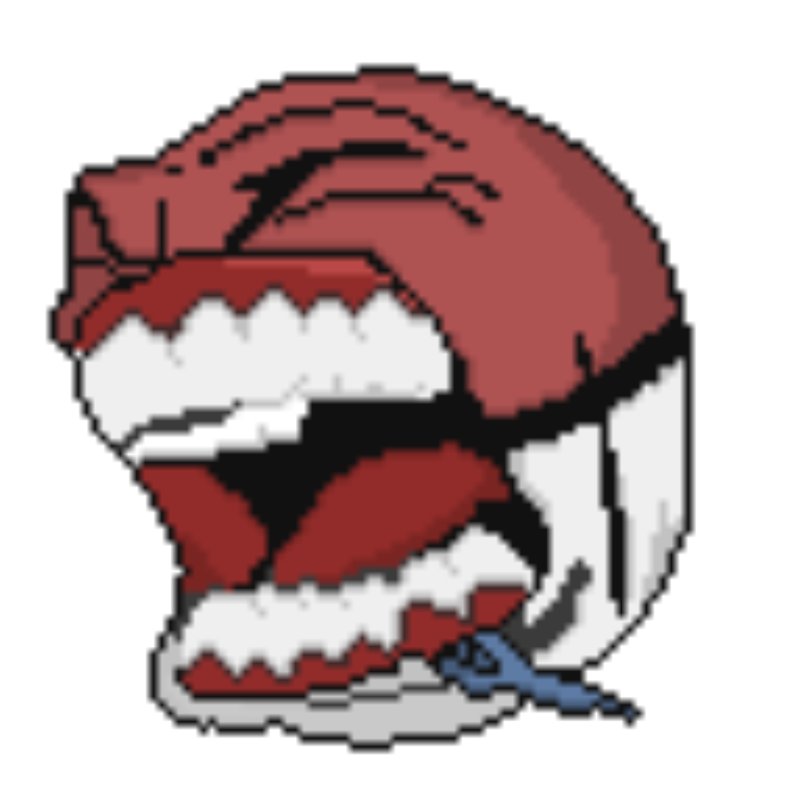

  

<h1 align="center">
  Athlon Showdex
</h1>

  A fork of <a href="https://github.com/doshidak/showdex"><code>doshidak/showdex</code></a>, adapted for
  <a href="https://play.pokeathlon.com"><strong>Pokéathlon</strong></a> &mdash; the Infinite Fusion + fangame
  Pokémon&nbsp;Showdown server.

  <a href="https://github.com/HowToBasicMons/Athlon-Showdex/releases">Releases</a> ·
  <a href="https://play.pokeathlon.com">Pokéathlon</a> ·
  <a href="https://discord.gg/vsEN6mzuNj">Pokéathlon Discord</a>

 

## What is this?

**Athlon Showdex** is the in-battle damage calculator (Calcdex) from [Showdex](https://github.com/doshidak/showdex),
re-tuned so it actually understands Pokéathlon's mechanics. It injects **only** on
[`play.pokeathlon.com`](https://play.pokeathlon.com) and reads straight from the live client, so it stays in sync with
the server's custom data.

## What's different from upstream Showdex

- **Infinite Fusion support** — fused base stats (head/body bias), fused typing, merged ability & move pools, and the
  proper fusion name (e.g. *Jilucha*, *Sylnite*) in the header.
- **Fusion sprites** — pulls Pokéathlon's custom fusion art, with fallbacks to the head's fangame/vanilla sprite (so
  Chaos fusions & artless pairs still render).
- **Custom types** — Sound, Light, Cosmic, Nuclear & Crystal are wired through typing, move types, the type chart and
  damage effectiveness.
- **Custom-mod formats** — Soulstones, Insurgence, Uranium, Infinity, Mariomon & Chaos are recognized; their custom
  rosters/moves/items/types resolve in the calc.
- **Pokéathlon presets** — opponent sets are predicted from Pokéathlon's own usage data (incl. fusion sets, matched by
  exact head+body), plus a bundled **Mariomon Random Battle** set dump.
- **Custom items** — selectable across the board, with stat-multiplier effects (Goomba Boots, Sturdy Shell, the Orion
  orbs, Anchor, Assault/Muscle Armor, Wise Vest, …) applied to both the shown stats and the damage calc.
- **Pokéathlon branding** — Electrode-Mega mascot/icon, Athlon Showdex naming, and Pokéathlon-only injection.

## Install (beta)

This is currently distributed to beta testers as an unpacked Chrome/Edge extension:

1. Download the latest `.zip` from [Releases](https://github.com/HowToBasicMons/Athlon-Showdex/releases) and unzip it
   to a permanent folder.
2. Go to `chrome://extensions`, enable **Developer mode** (top-right).
3. Click **Load unpacked** and select the unzipped folder.
4. Open [`play.pokeathlon.com`](https://play.pokeathlon.com) and start or spectate a battle — the Calcdex appears.

On updates: hit the **reload** icon on the extension card, then refresh the battle tab.

## Mechanics accuracy & known limitations

Athlon Showdex mirrors Pokéathlon's own client logic as closely as possible, but it's a fan tool — some
things are exact, some are approximations. Here's the honest state of it.

### Working / verified
- **Fused base stats & typing** — head/body bias matches the server; typing is read straight from the Infinite
  Fusion mod data (can't drift).
- **Custom type chart** — read live from the client, so Sound / Light / Cosmic / Nuclear / Crystal and any server
  matchup tweaks are always current.
- **Custom item stat effects** — all 12 stat-multiplier items are wired (Goomba Boots, Sturdy Shell, the Orion orbs,
  Anchor, Assault/Muscle Armor, Wise Vest, Arcane Spellbook, …), in both the shown stats and the damage calc.
- **Aegislash Stance Change on fusions** — Shield ↔ Blade. Blade keeps the Shield fusion and **swaps the fused
  Atk↔Def & SpA↔SpD** (the real PIF mechanic), auto-switches from the last move used, persists across battle
  updates, and keeps the fusion name + sprite. Works whether Aegislash is the head or the body.
- **Eviolite** — applies when *either* half is not-fully-evolved.
- **Custom abilities** — fangame abilities like Athenian / Pure Focus / Genius (×2 SpA), Sharp Coral, Tormented
  (always-on), plus the weather/terrain/status-gated ones (Sandy Defense, Forest King, Ice Cleats, Psycho Slider,
  Attunement, Supercell, Shadow Dance, Absolution) are applied to **both** the displayed stats and the damage calc.
  The custom **New Moon** weather is tracked for these.

### Known limitations (not yet 100%)
- **Body-half Aegislash manual toggle** — you can only manually click Shield/Blade when Aegislash is the *head*
  (the forme switcher is head-based). If it's the *body*, only the auto-switch (from the last move) works.
- **New Moon's own damage effects** — the weather is tracked for abilities, but its Ghost/Dark ×1.35 & Fairy ×0.75
  damage modifiers aren't in the calc yet, and it can't be picked manually from the weather dropdown (it auto-syncs
  from battles).
- **Expert (signature) moves** — matched by head/body species, not full evolution-line expansion, so a few rare
  cases may be missing or over-eager.
- **Presets** — usage-based predictions + sample sets currently cover Mariomon best; other mods (Insurgence,
  Uranium, Infinity, Chaos, Soulstones) lean on usage data only.
- **Browser** — only a **Chrome/Edge** (unpacked) build is shipped right now; no Firefox `.xpi` yet.

### Pros / cons at a glance
- **Pros:** real fusion stats/typing/abilities/items, live custom type chart, Pokéathlon-only injection, fast
  in-battle calc, no manual data upkeep (reads the live client).
- **Cons:** beta/unpacked (manual install + updates), a few fangame abilities not in the damage number yet,
  Chrome-only, preset depth varies by mod.

Found something wrong? File it at [Issues](https://github.com/HowToBasicMons/Athlon-Showdex/issues) with the
fusion (which half is which), item/ability/nature, and the stat shown vs expected.

## Credits

- **Maintained by** [HowToBasicMons](https://github.com/HowToBasicMons).
- **Beta testing** — Psychoplasm, Aevilok, I Like Porygon2, Jaykio, NiaDoesDumbStuff & Rowlet. Thank you for the bug
  reports and matchups. 💜
- **Stance Change** — special thanks to **Jaykio** and **I Like Porygon2** for testing the Aegislash fusion stance
  mechanic and helping get the Blade/Shield stat swap right.

### Built on Showdex — go show the original devs some love

Athlon Showdex exists only because of the incredible work by **Bot Keith** & **analogcam** on
[Showdex](https://github.com/doshidak/showdex). If you enjoy this, please support the people who built the foundation:

- ❤️ Support on [Patreon](https://patreon.com/showdex) or via [PayPal](https://paypal.com/donate/?hosted_button_id=ZUYJAGAVX6MBN)
- 💬 The original [Showdex Smogon thread](https://smogon.com/forums/threads/showdex-an-auto-updating-damage-calculator-built-into-showdown.3707265) and [Discord](https://discord.gg/2PXVGGCkm2)
- ⭐ Star the [upstream repo](https://github.com/doshidak/showdex)

## License

Licensed under **AGPL-3.0**, the same as upstream Showdex — see [`LICENSE`](./LICENSE). As a network-facing fork, the
full source is published here. All original Showdex copyright and attribution is retained.
